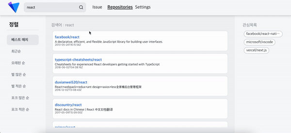
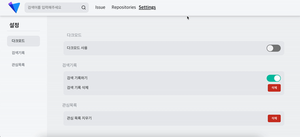
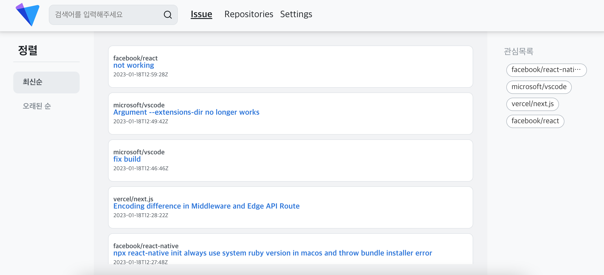

#  Payhere 과제

```text
고객은 내가 자주 가는 GitHub의 Public Repository의 Issue들을 모아서 보고 싶다.
찾아보니 GitHub에서 Open API를 제공하기 때문에, 이를 활용해서 개발할 수 있다.
자세한 요구사항은 다음과 같다. 
```
## 📝 요구사항

- [x] 검색창에 Repository명을 입력해서 Repository를 검색할 수 있다.
- [x] 검색된 Public Repository를 등록할 수 있다.
    - [x] 등록 개수는 최대 4개로 제한하며, 최대 개수 초과 등록 시 이를 사용자에게 알려준다.
    - [x] 웹은 LocalStorage, 앱은 Async Storage 등 로컬 저장소를 활용한다. (웹 혹은 앱 선택)
- [x] 등록된 Repository를 삭제할 수 있다.
- [x] 등록된 각각의 Public Repository의 issue를 한 페이지에서 모아서 볼 수 있다.
    - [x] 각 issue 마다 제목, Repository 명은 필수로 표현되어야 한다. 그 이외의 데이터 중 필요하다고 생각되는 부분은 추가한다.
    - [x] 해당 issue를 클릭하면 Github의 상세 페이지로 이동할 수 있다.
    - [x] 페이지네이션을 통해서 계속해서 issue를 모아서 볼 수 있다.
- [ ] 기능 추가
    - [ ] Github 로그인 추가
    - [ ] issue 필터링
    - [x] Settings 페이지 추가
    - [x] 다크모드
    - [x] 검색목록
    - 


## 📦 사용 라이브러리 및 스택

  

 

 

## 🖥 시연 화면
### Repository 검색 후 추가하기


### Settings 다크모드 및 검색기록


### Issues 모아보기


## 🤔 과제 참여 후

과제를 받은 후 어떻게하면 나를 더 어필할 수 있을까? 라는 고민을 많이 했습니다.  
그러다보니 기획단계에서 시간을 정말 많이 허비하였고...  
그 결과 개발에 몰두할 수 있는 시간이 4일도 남지 않았다는 사실에 걱정이 많이 되었지만  
기획을 크게 틀지 않는다면 시간내에 할 수 있을것이라 생각하며 개발을 진행하였습니다.  

구현에서 제일 힘들었던 부분은 Issue 모아보기였습니다. error boundary와 react-query를 함께 고려해야하는 상태에서  
Github API에서 repository별 issuee들을 한번에 받아올 수 있는 API가 없었기 때문에 under fetching이 되었습니다.
그로인해 Promise.all로 받은 데이터를 시간순으로 모아서 정렬하기위해 sorting하는 작업까지 더해 시간이 가장 많이 걸린 작업이었습니다.  
graphQL로 변경하기에는 시간이 얼마 남지 않았던 상태라, 제출시점까지는 REST API로 진행하고,  
과제 제출 이후에 여유를 가지고 보완하려 계획하고있습니다.  

과제를 진행하며 가장 아쉬웠던부분은 Testing Library입니다.  
평상시에 간단한 컴포넌트의 테스트 코드만 작성해왔기때문에 만만하게만 생각했었습니다.  
하지만 props만 받는 컴포넌트와는 달리, recoil과 data fetching을 함께 사용하는 컴포넌트는 스타일에 대한 테스트코드밖에 작성할 수 없었고  state, data fetching이 존재하는 컴포넌트는 부실하게 작성하거나 아예 작성을 못한 곳도 있었습니다.  
이 부분을 제가 여태까지 간과해왔었고 과제에서도 처참히 패하고 말았습니다.  
아쉬웠던만큼 가장 많이 해결하고싶은 욕심이 생기게 만드는 부분이기도 하기때문에 과제가 끝난 이후에도 이 부분만은 기필코 보완하여 코드 커버리지를 90% 이상으로 올릴 계획입니다.  